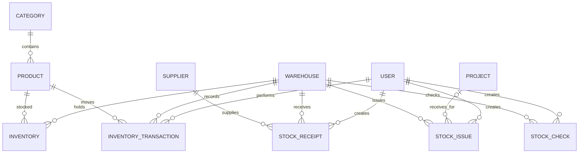

# PHASE 02 — MongoDB Database Design

## Mục tiêu

Thiết kế MongoDB collections, embedded documents, references, indexes, validation boundaries và transaction strategy cho toàn hệ thống.

## Quyết định Thiết kế

- Persistence: MongoDB qua Mongoose và `@nestjs/mongoose`.
- ID: MongoDB `ObjectId` cho `_id` và reference fields.
- Ưu tiên embed item trong chứng từ vì item luôn được đọc/ghi cùng header và không có vòng đời độc lập.
- Master data, Inventory và InventoryTransaction là collections riêng dùng references.
- Không có Product.quantity.
- Không dựa vào MongoDB populate để đảm bảo integrity; service kiểm tra reference tồn tại/status trước write.
- Local MongoDB phải chạy replica set để hỗ trợ multi-document transaction.

## Collections

### users

```text
_id, email, passwordHash, fullName, role, status,
lastLoginAt?, createdAt, updatedAt
```

Indexes: unique email; role/status phục vụ filter.

### categories

```text
_id, code, name, description?, status, createdAt, updatedAt
```

Indexes: unique code; unique normalizedName để chống trùng không phân biệt hoa/thường.

### products

```text
_id, sku, name, categoryId, brand?, model?, unit,
costPrice, minStock, warrantyMonths, description?, imageUrl?,
status, createdAt, updatedAt
```

- `costPrice`: integer VND, không dùng floating point cho tiền.
- Indexes: unique sku; categoryId; status; name/brand/model phục vụ search.
- Không có trường quantity.

### suppliers

```text
_id, code, name, contactName?, phone?, email?, address?,
taxCode?, status, createdAt, updatedAt
```

Indexes: unique code; status/name.

### warehouses

```text
_id, code, name, address?, description?, status,
createdAt, updatedAt
```

Indexes: unique code; status/name.

### inventories

```text
_id, productId, warehouseId, quantity, version,
createdAt, updatedAt
```

Constraints/indexes:

- Compound unique `{ productId: 1, warehouseId: 1 }`.
- quantity là integer và `>= 0`.
- version là integer tăng sau mỗi mutation, dùng optimistic stale-check.
- Index riêng productId và warehouseId phục vụ filter/aggregate.

### stock_receipts

```text
_id, code, supplierId, warehouseId, receiptDate,
createdBy, note?, status, confirmedAt?,
items: [{ _id, productId, quantity, unitPrice }],
createdAt, updatedAt
```

- Items embedded, tối thiểu một dòng.
- productId không lặp trong items; quantity > 0; unitPrice >= 0.
- Indexes: unique code; supplierId; warehouseId; status+receiptDate; createdBy.

### stock_issues

```text
_id, code, warehouseId, projectId?, issueDate,
createdBy, note?, status, confirmedAt?,
items: [{ _id, productId, quantity }],
createdAt, updatedAt
```

- Items embedded; productId không lặp; quantity > 0.
- Indexes: unique code; warehouseId; projectId; status+issueDate; createdBy.

### inventory_transactions

```text
_id, productId, warehouseId, type, quantity,
previousQuantity, newQuantity,
referenceType, referenceId, note?, createdBy, createdAt
```

- `quantity` có dấu: IMPORT dương, EXPORT âm, ADJUSTMENT theo difference.
- `previousQuantity + quantity = newQuantity`.
- Audit collection bất biến, không timestamps updatedAt.
- Indexes: `{ productId, warehouseId, createdAt }`, `{ referenceType, referenceId }`, `{ type, createdAt }`, createdBy và createdAt.

### projects

```text
_id, code, name, customerName, address?, capacity?,
status, startDate?, note?, createdAt, updatedAt
```

Indexes: unique code; status; startDate; name/customerName.

### stock_checks

```text
_id, code, warehouseId, checkDate, createdBy,
note?, status, confirmedAt?,
items: [{
  _id, productId, systemQuantity, actualQuantity?,
  difference?, inventoryVersion
}],
createdAt, updatedAt
```

- Items embedded vì luôn thuộc một đợt kiểm kê.
- actualQuantity/difference nullable khi DRAFT, bắt buộc khi CONFIRMED.
- difference = actualQuantity - systemQuantity.
- inventoryVersion ghi snapshot để phát hiện dữ liệu stale.
- Indexes: unique code; warehouseId; status+checkDate; createdBy.

## Enums

```text
Role: ADMIN | WAREHOUSE_MANAGER | STAFF
UserStatus: ACTIVE | INACTIVE
EntityStatus: ACTIVE | INACTIVE
DocumentStatus: DRAFT | CONFIRMED | CANCELLED
TransactionType: IMPORT | EXPORT | ADJUSTMENT
ReferenceType: STOCK_RECEIPT | STOCK_ISSUE | STOCK_CHECK
ProjectStatus: PLANNED | IN_PROGRESS | COMPLETED | CANCELLED
```

## Relationship Map



Embedded receipt/issue/check items chứa productId reference nhưng không là collection độc lập.

## Referential Integrity

MongoDB không có foreign key. Service bắt buộc:

- Validate ObjectId trước query.
- Kiểm tra referenced document tồn tại và ACTIVE khi nghiệp vụ yêu cầu.
- Không hard-delete entity đã được tham chiếu; chuyển INACTIVE.
- Chỉ dùng `populate` cho response cần thiết, không dùng populate như validation.
- Không cho client tự gửi `createdBy`, transaction type hoặc previous/new quantity.

## Document Lifecycle

```text
DRAFT -> CONFIRMED
DRAFT -> CANCELLED
```

- Chỉ DRAFT được sửa hoặc cancel.
- CONFIRMED/CANCELLED không được sửa items hoặc confirm lại.
- Cancel CONFIRMED không nằm trong MVP; nếu bổ sung phải dùng reversal document, không sửa audit log.

## Concurrency Strategy

### Stock Issue

Không dùng chuỗi không an toàn `find -> check -> save`. Trong session transaction, mỗi item dùng:

```javascript
findOneAndUpdate(
  { productId, warehouseId, quantity: { $gte: requestedQuantity } },
  { $inc: { quantity: -requestedQuantity, version: 1 } },
  { new: false, session }
)
```

Không match nghĩa là thiếu tồn; throw conflict để abort toàn bộ phiếu.

### Receipt

Upsert Inventory và `$inc` quantity/version trong session. Sau mỗi update, tạo transaction với previous/new quantity tương ứng.

### Stock Check

Update chỉ khi `_id`, quantity và version vẫn khớp snapshot. Nếu không match, trả 409 `STOCK_CHECK_STALE` và yêu cầu refresh/recount.

## MongoDB Session Transaction Template

```text
session = startSession()
try:
  session.startTransaction()
  validate state/references
  mutate inventories with session
  insert inventory transactions with session
  mark document CONFIRMED with session
  commitTransaction()
catch:
  abortTransaction()
  rethrow mapped exception
finally:
  endSession()
```

Không gọi external API hoặc thao tác chậm trong transaction. Với transient transaction/write conflict, service có thể retry toàn transaction tối đa ba lần.

## Low Stock Aggregation

- Bắt đầu từ products ACTIVE để không bỏ product chưa có inventory.
- `$lookup` inventories, `$group/$sum` quantity theo product.
- Chỉ tính warehouse ACTIVE.
- Match `totalStock <= minStock`.

## Inventory Value

- Giá lưu dạng integer VND trong JavaScript safe integer range được kiểm tra bởi validation.
- Tổng giá trị dùng MongoDB aggregation; response tài chính được format thống nhất.
- MVP không triển khai FIFO/weighted-average; giá trị tồn = quantity x Product.costPrice.

## Error and Edge Cases

- Duplicate key E11000 được map sang 409.
- Invalid ObjectId: 400; missing reference: 404; inactive reference: 400.
- Empty/duplicate items: 400.
- Double-confirm hoặc invalid transition: 409.
- Insufficient inventory: 409; không mutation nào được commit.
- Transaction unavailable do MongoDB standalone: fail startup/health guidance, không chạy fallback non-atomic.

## Test Cases

- Compound unique inventory ngăn duplicate product/warehouse.
- Receipt nhiều items commit/rollback toàn bộ.
- Issue đủ tồn cập nhật đúng previous/new; thiếu một item rollback cả phiếu.
- Hai issue đồng thời không làm quantity âm.
- Stock check stale bị từ chối.
- Product zero-inventory vẫn xuất hiện trong low stock.
- Audit reference truy ngược đúng document.

## Files to Implement

- `backend/src/database/database.module.ts`
- `backend/src/users/schemas/user.schema.ts`
- `backend/src/categories/schemas/category.schema.ts`
- `backend/src/products/schemas/product.schema.ts`
- `backend/src/suppliers/schemas/supplier.schema.ts`
- `backend/src/warehouses/schemas/warehouse.schema.ts`
- `backend/src/inventory/schemas/inventory.schema.ts`
- `backend/src/stock-receipts/schemas/stock-receipt.schema.ts`
- `backend/src/stock-issues/schemas/stock-issue.schema.ts`
- `backend/src/inventory-transactions/schemas/inventory-transaction.schema.ts`
- `backend/src/projects/schemas/project.schema.ts`
- `backend/src/stock-checks/schemas/stock-check.schema.ts`

## Dependencies

- `mongoose`
- `@nestjs/mongoose`
- MongoDB local replica set.

## Definition of Done

- Collections, embedded items, references, indexes, lifecycle và concurrency được chốt.
- Không còn Prisma/PostgreSQL trong database design.
- Product không có quantity; Inventory có compound unique index.
- Receipt/Issue/Check dùng MongoDB session transaction và transaction history đầy đủ.

